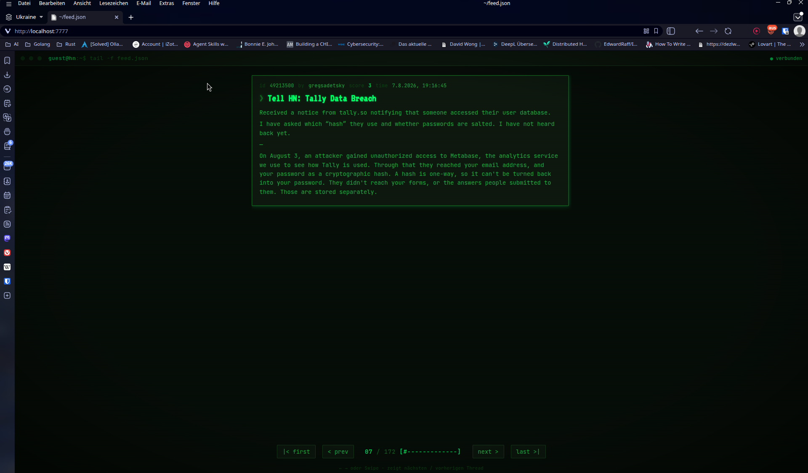

# go-news

A Go service that fetches articles from [Hacker News](https://news.ycombinator.com/), keeps them in memory, and exposes them via an HTTP API and an MCP server.

## How it works

- On startup, the most recent article ID (watermark) is fetched from Hacker News.
- Older articles are then loaded (default `1000`).
- A ticker polls for new articles every 5 seconds and adds them.
- Articles are fetched in parallel by workers (`WORKERCOUNT`, default `10`).
- Workers distinguish between **stories** and **comments**. A comment is walked up to its parent story before it is stored, so every stored item is a complete thread.
- A worklog (lock) prevents two workers from processing the same story/thread at the same time.
- Every `HALFTIME` hours since fetch (default `12`), items that are older than that are deleted from memory to limit memory usage (at least `MINARTICLE` items are kept).
- Articles are stored in a map keyed by their ID.
- The in-memory data is periodically persisted to `data.json` (every `PERSISTENCEINTERVAL` minutes) and reloaded on the next start.

## Configuration (environment variables)

| Variable              | Default            | Description                                              |
|------------------------|--------------------|----------------------------------------------------------|
| `SERVER`              | `localhost:7777`   | Address of the HTTP debug server                         |
| `MCPSERVER`           | `localhost:13333`  | Address of the MCP server                                |
| `WORKERCOUNT`         | `10`               | Number of parallel fetch workers                         |
| `HALFTIME`            | `12`               | Hours after which fetched items are deleted from memory  |
| `PRELOADITEMS`        | `1000`             | Number of older articles to load initially               |
| `MINARTICLE`          | `10`               | Minimum number of items kept in memory                   |
| `PERSISTENCEINTERVAL` | `5`                | Minutes between writes of the in-memory data to `data.json` |
| `DEBUG`               | *(unset)*          | Set to `TRUE` to enable verbose debug logging            |

## HTTP endpoints

| Route             | Method | Description                                               |
|-------------------|--------|-----------------------------------------------------------|
| `/`               | GET    | Debug view (`index.html`)                                 |
| `/api/items`      | GET    | All articles as a JSON map (keyed by ID)                  |
| `/api/item/{id}`  | GET    | A single article by its ID as JSON                        |
| `/api/itemkeys`   | GET    | All article IDs as a JSON array, sorted descending        |
| `/api/watermark`  | GET    | Current watermark ID as JSON (for polling)                |



## Debug view

The debug view (`index.html`) renders the loaded articles and their comment threads. It features:

- **Manual refresh mode**: by default (`AUTO_REFRESH = false`) new data is only applied after clicking the "Update verfügbar" banner, so your scroll position is preserved while reading long threads. Set `AUTO_REFRESH = true` in `index.html` to apply new data automatically.
- **XSS-safe rendering**: user-supplied fields (title, URL, author) are HTML-escaped before being inserted into the page.

## MCP server

In addition to the HTTP API, the service starts an MCP server through which the loaded Hacker News articles can also be queried. The MCP server runs over SSE on port `13333`.

### MCP tools

| Tool                    | Description                                                              |
|--------------------------|--------------------------------------------------------------------------|
| `hackernews`             | Query articles and comments (see filters below)                          |
| `hackernewsArticleCount` | Number of articles currently held in memory                              |

### `hackernews` filters

| Parameter    | Type   | Description                                                                 |
|--------------|--------|-----------------------------------------------------------------------------|
| `filter`     | string | Required. `summary` (title/url/score) or `full` (all fields incl. comment count) |
| `minScore`   | number | Only articles with at least this score                                     |
| `maxAgeMinutes` | number | Only articles fetched within the last N minutes                          |
| `limit`      | number | Return at most N articles, highest score first                              |
| `id`         | number | **Story id**; returns that story's comment structure as `parent-id -> []child ids` (no text). Use the returned comment ids with `comments` to fetch their text |
| `comments`   | array  | **Comment ids** (NOT story ids) to fetch the comment text for. Get comment ids from the `id` parameter's comment structure |

## Start

```bash
go run main.go
```

Optionally with custom values:

```bash
SERVER=localhost:8080 MCPSERVER=localhost:13333 WORKERCOUNT=20 HALFTIME=12 PRELOADITEMS=1000 go run main.go
```

## systemd service

Build the binary and place it e.g. in `/usr/local/bin`:

```bash
go build -o go-news main.go
sudo install -m 0755 go-news /usr/local/bin/go-news
```

Unit file `/etc/systemd/system/go-news.service`:

```ini
[Unit]
Description=go-news Hacker News Fetcher & MCP-Server
After=network-online.target
Wants=network-online.target

[Service]
Type=simple
User=marco
Group=marco
WorkingDirectory=/home/marco/go/src/gittea.kittel.dev/marco/go-news
ExecStart=/usr/local/bin/go-news
Restart=on-failure
RestartSec=5

# Environment variables (optional, defaults see above)
Environment=SERVER=localhost:7777
Environment=MCPSERVER=localhost:13333
Environment=WORKERCOUNT=10
Environment=HALFTIME=12
Environment=PRELOADITEMS=1000
Environment=MINARTICLE=10
Environment=PERSISTENCEINTERVAL=5
# Environment=DEBUG=TRUE

# Resources / security
NoNewPrivileges=true
ProtectSystem=strict
ProtectHome=true
PrivateTmp=true
ReadWritePaths=/var/log

# Logging to journald
StandardOutput=journal
StandardError=journal
SyslogIdentifier=go-news

[Install]
WantedBy=multi-user.target
```

Enable and start the service:

```bash
sudo systemctl daemon-reload
sudo systemctl enable --now go-news
```

Status and logs:

```bash
systemctl status go-news
journalctl -u go-news -f
```
